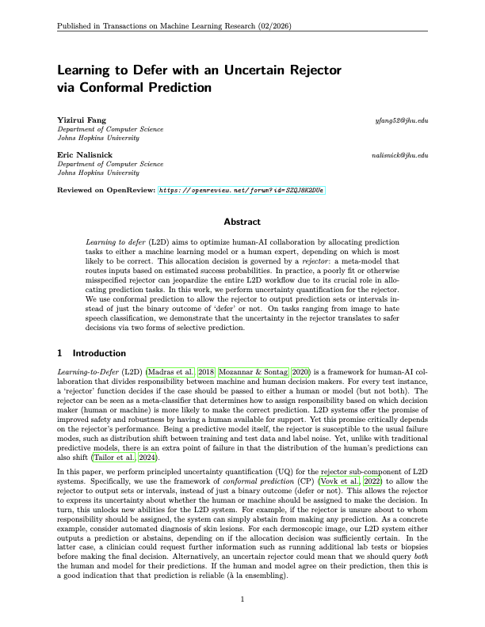
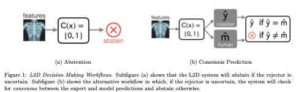
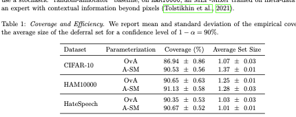
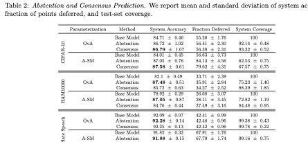
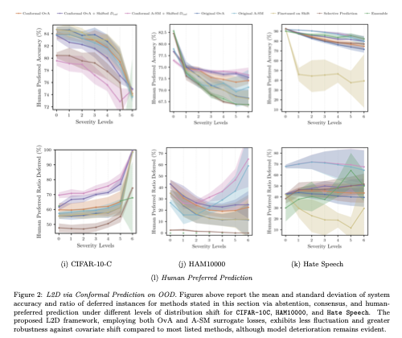
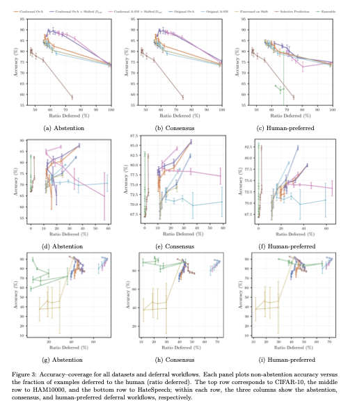

## Abstract-level summary

Learning to defer routes each input to either a machine learning model or a human expert. This paper studies a failure mode in that routing layer: the rejector can itself be misspecified, poorly calibrated, or brittle under shift. We apply conformal prediction to the rejector so it can express uncertainty through deferral sets instead of returning only a hard defer-or-predict decision.

The resulting system can take safer fallback actions when the rejector is uncertain, including abstaining, checking consensus between the model and expert, preferring the model when the human route is uncertain and cost matters, or preferring the human under distribution shift.

## Core idea

The standard learning-to-defer workflow depends on a rejector that chooses between the model and the expert. Instead of treating that rejector decision as certain, the paper constructs conformal deferral sets over whether the expert is expected to be correct. A singleton set supports an ordinary routing decision; an uncertain set unlocks safer workflows.

## Method

- Formulated uncertainty quantification for the rejector in learning-to-defer systems.
- Applied split conformal prediction to construct deferral sets with coverage behavior on expert correctness.
- Evaluated both one-vs-all and asymmetric-softmax rejector parameterizations.
- Tested abstention, consensus prediction, human-preferred routing, and model-preferred routing workflows.
- Ran experiments across CIFAR-10, HAM10000, and Hate Speech settings, including distribution-shift stress tests.

## Main tables

The first table shows that conformal rejectors can achieve the target coverage level while keeping deferral sets compact across image and text classification tasks.

The second table compares abstention and consensus workflows. The key tradeoff is safety versus availability: abstention improves reliability by withholding uncertain decisions, while consensus asks both the model and expert when routing is ambiguous.

## Distribution shift

Under covariate shift, the conformal workflows expose increasing rejector uncertainty through higher deferral or abstention behavior. This is useful because the model can avoid confidently routing examples when the deferral decision is unreliable.

## Accuracy-coverage tradeoff

The final comparison plots non-abstention accuracy against how often the system defers. The useful region is where the method improves safety or accuracy without pushing nearly all examples to the human expert.

## Why it matters

This project is a human-in-the-loop ML signal: it turns the human/model routing decision into an uncertainty-aware component with measurable coverage, calibration, and robustness properties. For applied scientist review, the strongest evidence is the connection between a practical system failure mode, a distribution-free uncertainty method, and experiments that evaluate behavior under realistic shift.
